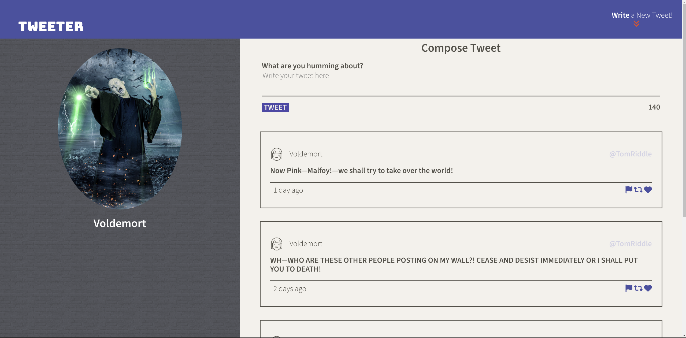

# Tweeter

Tweeter is a simple, single-page Twitter clone. It was created from a [basic template](https://github.com/lighthouse-labs/tweeter).

Tweeter does not have separate user accounts but you can submit tweets to a simulated "database". The website will dynamically update and display the new tweet (without refreshing the whole page). The latest tweets will appear at the top of the page.

It also has other elements like a character tracker that tracks your tweet's length as you type (and warns you if you go over 140 characters). There are also client-side validation checks which will reject empty tweets or those over 140 characters. A failed check will result in errors being displayed to the user.

Tweets will be added to the page by generating HTML Templates and populating it with tweet data from the user. This data will need to be sanitized before it is embedded in the template to avoid Cross-Site Scripting (XSS) attacks. For this reason, a user input sanitizer has also been implemented.

Lastly, Tweeter has also been designed to be responsive. This means that it has been developed in a Mobile-First fashion, but it can also be consumed from normal laptop and desktop PCs.

## Primary Skills & Technologies

Tweeter is an excellent platform for learning realistic frontend developer skills. These include:

 * HTML
 * CSS (Flexbox, Responsive Web Design, Media Queries)
 * Client-Side JavaScript: To validate form data and display it to the user.
 * jQuery: To bind Event Handlers and manipulate the DOM.
 * AJAX: To send and fetch information from a server without refreshing the page.
 * Git: Using Git to track development; includes the use of branches.
 * Other Skills: Learning how to contribute to Full-Stack web applications using modern Software Development patterns, tools and workflows.

## Dependencies

**Technology Stack**: Node.js, Express.js, jQuery, AJAX, HTML and CSS.

* Primary Dependencies:

  - Node.js: The standard JS backend framework/server environment.
  - Express.js: The standard backend web application framework.
  - Body-parser: A Node.js body parsing middleware.
  - Chance: A utility library to generate anything random.
  - md5: A JavaScript function for hashing messages with MD5.
  - Timeago: A jQuery plugin that makes it easy to support automatically updating fuzzy timestamps (e.g. "4 minutes ago").

* Developer Dependencies:

  - Nodemon: To auto-restart the program during debugging sessions.

## Getting Started

You can install the dependencies with these commands:

1. Clone this repository onto your local device.

2. Install Dependencies:

    * Primary Dependencies: `npm install express body-parser chance md5 timeago --save`

	* Developer Dependencies: `npm install nodemon --save-dev`

3. Start the web server using the `npm run local` command. The app will be served at <http://localhost:8080/>.

4. Go to <http://localhost:8080/> in your browser.
